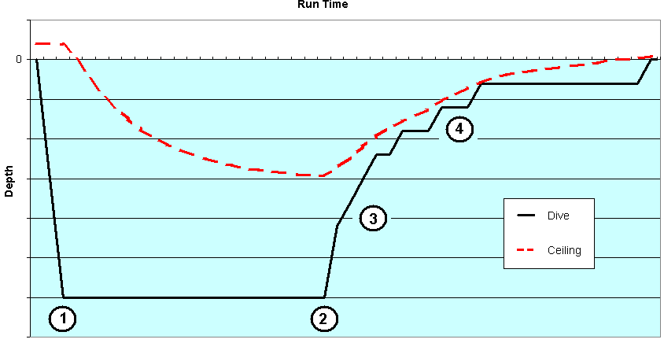
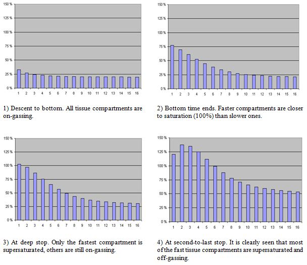
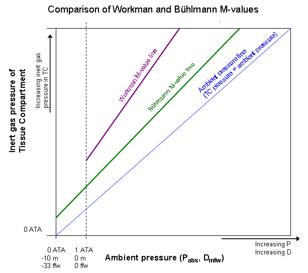
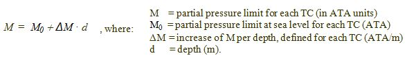
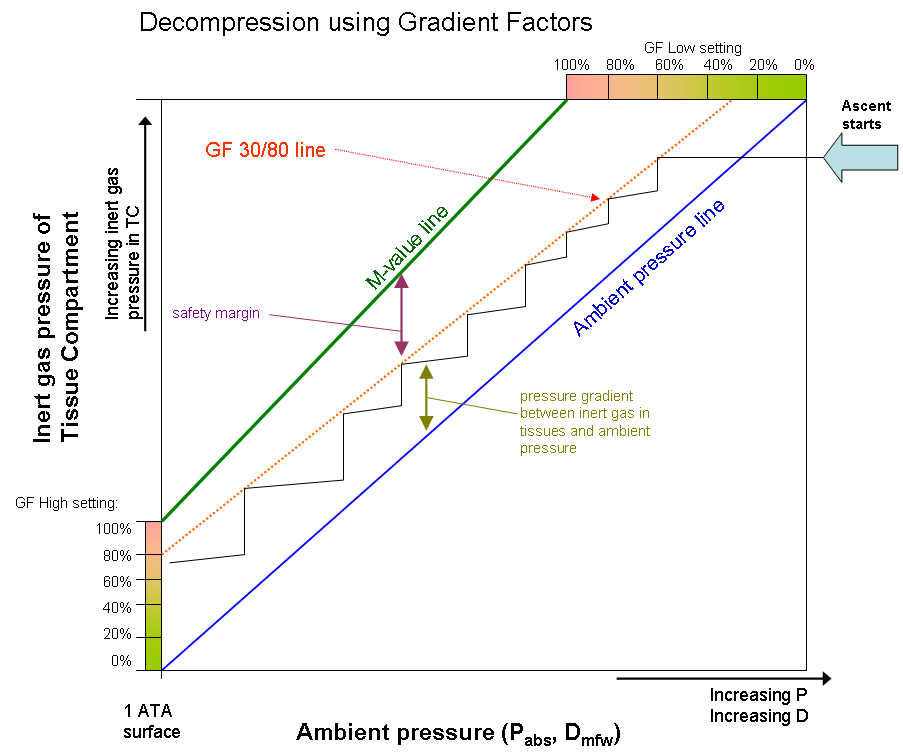
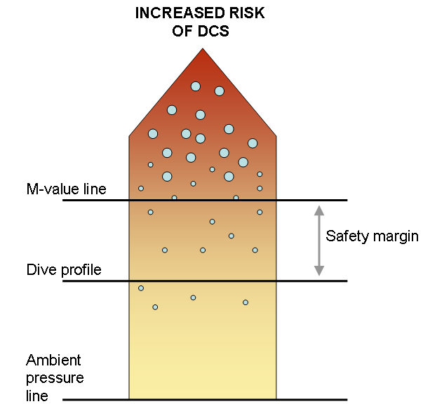
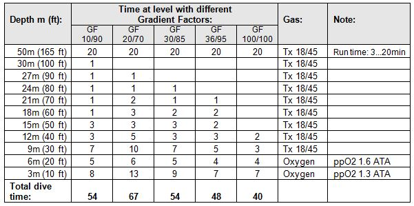
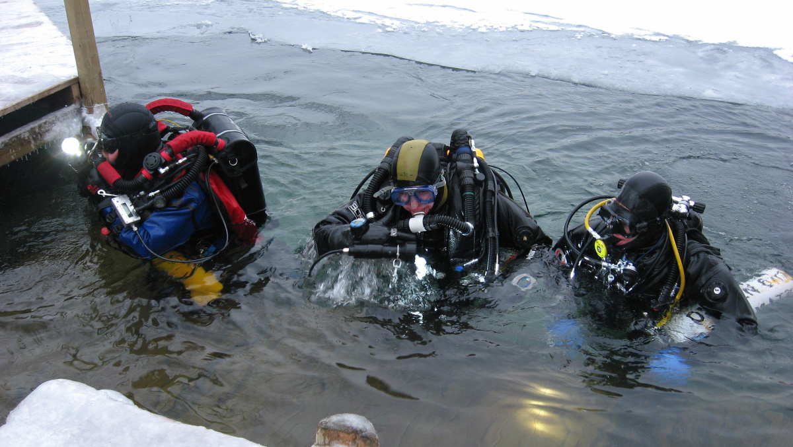

# Gradient Factors (梯度因子 + 减压理论)

> **原文**: [Gradient Factors - Dive Rite](https://diverite.com/gradient-factors/)
> 
> **作者**: Grace Lambert

---

## 前言 | Introduction

Remember your first diving classes and the lesson about bubbling soda bottle and too rapid ascents? No matter how deeply you study the decompression theory, this soda bubble analogy is still valid. However, it's time to introduce some more fundamentals of the issue. But let's start from the history:

还记得第一次潜水课时关于摇晃汽水瓶和快速上升的教训吗？无论你对减压理论的研究有多深入，这个汽水气泡的类比仍然有效。然而，现在是时候介绍一些更基础的知识了。让我们先从历史开始：

---

## 历史 | History

### 保罗·伯特 (Paul Bert, 1833-1886)

Decompression theory is a relatively old science. Already in late 1800's, French physiologist Paul Bert (1833-1886) discovered decompression sickness and the need for decompression stops and slow ascend speed. Bert also studied the effects of oxygen to the humans, as he was more interested in the physiological effects of mountaineering and hot air ballooning. He also extended his studies to cover high pressure environments, and found out later about oxygen toxicity. Bert made a conclusion that high oxygen partial pressures affect humans chemically, not mechanically, as he described the causes of Central Nervous System (CNS) oxygen toxicity. When Bert studied air and nitrogen, he correctly determined the cause of the Decompression Sickness (DCS) to be caused by the nitrogen bubbles in the blood and other tissues (mechanical effects). Bert also did experiments on recompression therapy and oxygen administration in DCS cases. The most famous of Bert's books is "La Pression barometrique" 1 , published in 1878, which dealt with the human physiology in low and high air-pressures.

减压理论是一门相对古老的科学。早在 1800 年代末，法国生理学家保罗·伯特（1833-1886）就发现了减压病以及减压停留和缓慢上升的必要性。伯特还研究了氧气对人体的影响，因为他对登山和热气球运动的生理效应更感兴趣。他还将研究扩展到高压环境，并随后发现了氧气毒性。伯特得出结论：高氧分压对人体的影响是化学性的，而非机械性的，他描述了中枢神经系统（CNS）氧气毒性的原因。当伯特研究空气和氮气时，他正确地确定了减压病（DCS）是由血液和其他组织中的氮气泡引起的（机械效应）。伯特还进行了高压氧治疗和 DCS 病例中氧气给药的实验。伯特最著名的著作是 1878 年出版的《La Pression barometrique》（大气压力），该书论述了人在低气压和高气压环境中的生理学。

### 约翰·斯科特·霍尔丹 (John Scott Haldane, 1860-1936)

While Bert laid the fundamentals to the decompression studies, it was John Scott Haldane (1860-1936), a Scottish physiologist who approached the problem of decompression theory with more scientific approach. In 1905, Haldane was appointed by the Royal Navy to perform research about Navy's diving operations. His focus was to study the decompression sickness and how it could be avoided. Haldane performed several tests and studied the effects of compressed air at depth, and in 1908 he published the results of his tests in the Journal of Medicine 2. This article also contained his diving tables.

虽然伯特为减压研究奠定了基础，但苏格兰生理学家约翰·斯科特·霍尔丹（1860-1936）以更科学的方法处理减压理论问题。1905 年，霍尔丹被英国皇家海军任命进行海军潜水作业研究。他的重点是研究减压病及其预防方法。霍尔丹进行了多项测试，研究了压缩空气在深水中的效果，并于 1908 年在《医学杂志》上发表了他的测试结果 2。这篇文章也包含了他的潜水表。

Haldane is considered to be the father of modern decompression theory. In his research, he made an important conclusion that a diver could surface from an indefinitely long 10m/33ft dive without DCS. From this result, he determined that human body could tolerate pressure change with a factor of 2:1 (the pressure in 10m/33ft is 2 ATA, while on surface it is 1 ATA). Later this number was refined to be 1.58:1 by Robert Workman. Workman was an M.D. and decompression researcher in U.S. Navy during 1960's. He studied systematically the decompression model that was used in the U.S. Navy and which was then based on Haldane's research. In addition to refining the tissue pressure ratio, Workman found out that the ratio varied by tissue type (hence the term "tissue compartment" or TC, representing different half-times, e.g. speed of gas dissolving) and depth.

霍尔丹被认为是现代减压理论之父。在他的研究中，他得出了一个重要结论：潜水员可以从任意长时间的 10 米/33 英尺潜水而不患减压病。基于这一结果，他确定人体可以承受 2:1 的压力变化因子（10 米/33 英尺处的压力为 2 ATA，而水面压力为 1 ATA）。后来这个数字被罗伯特·沃克曼修正为 1.58:1。沃克曼是 1960 年代美国海军的医学博士和减压研究员。他系统地研究了美国海军使用的减压模型，该模型基于霍尔丹的研究。除了完善组织压力比例外，沃克曼还发现该比率因组织类型（因此有了"组织隔室"或 TC 这个术语，代表不同的半时，例如气体溶解速度）和深度而异。

### 阿尔伯特·A·布尔曼博士 (Dr. Albert A. Bühlmann, 1923-1994)

Dr. Albert A. Bühlmann (1923-1994) from Zürich developed decompression theory further. During his long research career, he extended the number of tissue compartments to 16, which was the basis of his ZH-L16 decompression model ("ZH" as Zürich, "L" as Linear and "16" for the number of TCs). The first set of ZH-L16 tables was published in 1990 (previous tables 3, published earlier, contained smaller amount of TCs).

来自苏黎世的阿尔伯特·A·布尔曼博士（1923-1994）进一步发展了减压理论。在漫长的研究生涯中，他将组织隔室的数量扩展到 16 个，这是他的 ZH-L16 减压模型的基础（"ZH"代表苏黎世，"L"代表线性，"16"代表组织隔室数量）。第一套 ZH-L16 表于 1990 年发布（之前的表格 3 更早发布，包含较少的组织隔室）。

---

## 基础原理 | Basics

Let's start from basics: A diver goes down and breathes compressed air from his/her cylinder. Air contains nitrogen, which, as an inert gas, dissolves into the diver's tissues. When the diver starts ascending, the ambient pressure decreases and dissolved nitrogen transfers from other tissues to the blood, from there to the lungs and finally leaves the body with each exhale cycle. Simple as that, is it?

让我们从基础开始：潜水员下潜并从气瓶中呼吸压缩空气。空气含有氮气，作为惰性气体，它会溶解到潜水员的组织中。当潜水员开始上升时，环境压力降低，溶解的氮气从其他组织转移到血液，再从血液转移到肺部，最后通过每次呼气循环离开身体。就这么简单，对吧？

In recreational diving, no decompression dives are being conducted. Divers are told to stay within their no-decompression limits (NDL) of bottom time. This NDL is shown in diving tables, and besides that, divers must stay within certain ascent speed. This information is generally enough for most divers, but what is the case when we exceed the NDL and start accumulating decompression time?

在休闲潜水时，不进行免减压潜水。潜水员被告知要保持在底部时间的免减压极限（NDL）内。这个 NDL 显示在潜水表中，此外，潜水员还必须保持在一定的上升速度内。这些信息对大多数潜水员来说通常就足够了，但当我们超过 NDL 并开始累积减压时间时会怎样呢？

---

## 天花板 | The Ceiling

When we dive, we always have an invisible ceiling above us. This ceiling is a depth, which we can ascend to without getting DCS symptoms (generally speaking). The ceiling is based on the amount of dissolved inert gas in our tissues.

当我们潜水时，头顶始终有一个看不见的"天花板"。这个天花板是一个深度，我们可以上升到这个深度而不会出现 DCS 症状（一般来说）。天花板基于我们组织中溶解的惰性气体量。

*图 1：典型的减压潜水剖面图，可见天花板线。数字代表不同阶段（参见图 2 中的阶段）*

Figure 1 represents a typical decompression dive profile with multiple decompression stops. Before the dive, your "ceiling" is in fact negative depth (above surface), meaning that your tissues could tolerate certain overpressure gradient. As the run time increases and diver spends time at the bottom, the ceiling depth goes down and starts limiting the ascent possibilities, generating the need for decompression. In fact, some decompression software indicates the ceiling depth when user types in the desired dive levels. Diving computers indicate the ceiling as the deepest required decompression depth.

图 1 代表了一个典型的具有多个减压停留的减压潜水剖面图。潜水前，你的"天花板"实际上是负深度（在水面之上），这意味着你的组织可以承受一定的超压梯度。随着运行时间增加，潜水员在底部停留的时间越长，天花板深度就越深，并开始限制上升的可能性，产生减压的需要。事实上，一些减压软件会在用户输入目标潜水深度时显示天花板深度。潜水电脑将天花板显示为最深的所需减压深度。

When the ascent starts, the diver can not ascend above the ceiling without risking the possibility of decompression sickness. The decompression stops are clearly visible in the dive profile when the line goes below the ceiling depth. The closer one goes to the ceiling, the less margin of safety remains. The ceiling depth does not yet indicate on-gassing or off-gassing. Bühlmann used 16 tissue compartments to model inert gas dissolving in our body. These compartments either take more dissolved gas in (on-gassing) or expel dissolved gas out (off-gassing). The ceiling depth indicates the pressure change from current depth, in which the leading compartment off-gasses so fast, that further increased pressure drop would risk the possibility of DCS.

当上升开始时，潜水员不能在天花板之上继续上升，否则有患减压病的风险。当剖面线在天花板深度以下时，减压停留清晰可见。越接近天花板，安全裕度就越小。天花板深度并不指示吸气或排气。布尔曼使用 16 个组织隔室来模拟我们体内惰性气体的溶解。这些隔室要么吸收更多溶解气体（充气），要么排出溶解气体（排气）。天花板深度表示从当前深度开始的压力变化，在该压力变化下，领先隔室的排气速度快到如果压力进一步降低将有患 DCS 的风险。

*图 2：组织中惰性气体负荷的示例。组织隔室中的压力以百分比表示，100% 为环境压力。*

Figure 2 illustrates these 16 tissue compartments during the dive, presented in Figure 1. A tissue compartment (TC) has reached its saturation point when it is 100% full. During the ascent phase, a TC can go supersaturated (exceed 100%). The key of the decompression is to be supersaturated, but not so much that the dissolved gas would form excess bubbles to our tissues and blood.

图 2 展示了图 1 中潜水过程中这 16 个组织隔室。当组织隔室（TC）达到 100% 时即达到饱和点。在上升阶段，TC 可能变得过饱和（超过 100%）。减压的关键在于过饱和，但不能过度到溶解气体在我们组织和血液中形成过多气泡的程度。

As shown, the amount of dissolved gas, or specifically the partial pressure of the dissolved inert gas in our tissues, tends to follow the ambient pressure in which we are during the dive. The bigger the pressure difference (i.e. pressure gradient), the faster the gas dissolves, in both directions. This leads to an obvious question: Why not just come up? What are the limits of supersaturation, and how are they defined?

如图所示，溶解气体的量，更具体地说，我们组织中溶解的惰性气体的分压，趋向于跟随我们在潜水过程中所处的环境压力。压力差（即压力梯度）越大，气体在两个方向上溶解的速度就越快。这就引出了一个显而易见的问题：为什么不直接上来？过饱和的极限是什么？它们是如何定义的？

---

## M 值 | M-Values

Back to the history: Robert Workman introduced the term M-value, which means Maximum inert gas pressure in a hypothetical tissue compartment which it can tolerate without DCS. As mentioned, Haldane found out in his research that M-value is 2, and Workman refined it to be 1.58 (this number comes from pressure change from 2 ATA to 1 ATA, and taking into account that air has 79% inert gases, mainly nitrogen).

回到历史：罗伯特·沃克曼引入了 M 值的术语，它指的是假设组织隔室中可以耐受而不患 DCS 的最大惰性气体压力。如前所述，霍尔丹在研究中发现 M 值为 2，沃克曼将其修正为 1.58（这个数字来自从 2 ATA 到 1 ATA 的压力变化，并考虑到空气含有 79% 的惰性气体，主要为氮气）。

Workman determined the M-values using depths (pressure values) instead of ratios of pressure, which he then used to form a linear projection as a function of depth. The slope of the M-value line is called ΔM (delta-M) and it represents the change of M-value with a change in depth (depth pressure).

沃克曼使用深度（压力值）而非压力比来确定 M 值，然后他用这个来形成作为深度函数的线性投影。M 值线的斜率称为 ΔM（delta-M），它表示 M 值随深度（深度压力）变化的变化。

Bühlmann used the same method than Workman to express the M-values, but instead of using the depth pressure (relative pressure), he used absolute pressure, which is 1 ATA higher at depth. This difference is shown in Figure 3, where Workman's M-value line goes above Bühlmann's M-value line.

布尔曼使用与沃克曼相同的方法来表达 M 值，但使用的是绝对压力而不是深度压力（相对压力），这在深度上比相对压力高 1 ATA。这个差异如图 3 所示，其中沃克曼的 M 值线位于布尔曼的 M 值线之上。

*图 3：不同 M 值线的比较*

Figure 3 shows a comparison between Workman and Bühlmann M-value lines. A more detailed explanation can be found in literature 4, but it is easy to spot the greatest differences: while Workman M-value line is steeper than Bühlmann M-value line, there is also less margin for safety. Workman M-values also allow higher supersaturation than Bühlmann's.

图 3 显示了沃克曼和布尔曼 M 值线之间的比较。更详细的解释可以在文献 4 中找到，但很容易发现最大的差异：沃克曼的 M 值线比布尔曼的更陡，安全裕度也更小。沃克曼的 M 值也比布尔曼的允许更高的过饱和度。

To make things a bit more complex, it should be noted that while the M-values vary by tissue compartment, also two sets of M-values are used for each TC; M0-values (of depth pressure, indicating surfacing pressure. M0 is pronounced "M naught") and M-values of pressure ratio (ΔM, "delta-M" values). Workman defined the relationship of these different M-values as:

为了使事情变得更复杂，应该注意的是，虽然 M 值因组织隔室而异，但每个 TC 也使用两套 M 值；M0 值（深度压力，表示水面压力。M0 读作"M naught"）和压力比的 M 值（ΔM，"delta-M"值）。沃克曼定义了这些不同 M 值之间的关系为：

These sets of values are listed in literature 4. However, they concern the same thing: maximum allowed overpressure of the tissue compartments. It is also important to know, that decompression illness does not exactly follow the M-values. More sickness occurs at and above the pressures represented by the M-values, and less sickness occurs when divers stay well below the M-values.

这些值集在文献 4 中列出。然而，它们涉及的是同一件事：组织隔室的最大允许超压。同样重要的是要知道，减压病并不完全遵循 M 值。在 M 值所代表的压力及以上时会有更多疾病发生，而当潜水员远低于 M 值时疾病会减少。

---

## 梯度因子 | Gradient Factors

Gradient Factors are meant to offer conservatism settings for Bühlmann's decompression model. As mentioned in the previous chapter, M-value line sets a limit which is not supposed to be exceeded during ascent and decompression. However, as no decompression model can positively prevent all DCS cases, and because both dives and divers are individual, additional safety margin should be applied.

梯度因子旨在为布尔曼的减压模型提供保守性设置。如前一章所述，M 值线设置了一个在上升和减压过程中不应超过的限制。然而，由于没有任何减压模型可以完全防止所有 DCS 病例，而且由于每次潜水和每个潜水员都是个体化的，因此应该应用额外的安全裕度。

As shown in Figure 3, ascent and decompression occurs between the M-value line and Ambient Pressure line. Inert gas pressure in tissue compartments must exceed the ambient pressure to enable off-gassing. On the other hand, we do not want to go too close to the M-value line for safety reasons. Gradient Factors define the conservatism here.

如图 3 所示，上升和减压发生在 M 值线和环境压力线之间。组织隔室中的惰性气体压力必须超过环境压力才能实现排气。另一方面，出于安全考虑，我们不希望太接近 M 值线。梯度因子在这里定义了保守程度。

The Gradient Factor defines the amount of inert gas supersaturation in leading tissue compartment. Thus, GF 0% means that there is no supersaturation occurring and inert gas partial pressure equals ambient pressure in leading compartment (Note: The leading TC is not necessarily the fastest TC!). GF 100% means that decompression is being done in a situation where the leading TC is at its Bühlmann's M-value line and risk for DCS is far greater than using lower GF. (Note: Sometimes, especially in equations and calculations, GF's may be numbered as 0.00 … 1.00 instead of percentage. However, these are effectively the same thing as 100% = 1)

梯度因子定义了领先组织隔室中惰性气体过饱和的程度。因此，GF 0% 意味着没有发生超饱和，领先隔室中的惰性气体分压等于环境压力（注意：领先 TC 不一定是最快的 TC！）。GF 100% 意味着减压是在领先 TC 处于其布尔曼 M 值线的状态下进行的，患 DCS 的风险远高于使用较低 GF。（注意：有时，特别是在方程式和计算中，GF 可能被编号为 0.00...1.00 而不是百分比。然而，这些实际上与 100% = 1 相同）

*图 4：单组织隔室减压模型。图从右上角开始向左下延伸，位于环境压力线和梯度因子（GF）线之间。GF 线位于 M 值线之下，为减压形成安全裕度。纯布尔曼减压将遵循 M 值线（GF 100/100）。*

Some diver's did not like the idea of using the same conservatism factor throughout the ascent. Instead of having one GF, there was need to change the safety margin during the ascent. This led to two GF values; "GF Low" and "GF High". Low Gradient Factor defines the first decompression stop, while High Gradient Factor defines the surfacing value. Using this method, the GF actually changes throughout the ascent. This is illustrated in Figure 4, where GF Low and GF High forms start and end points to a Gradient Factor line. In that graph, decompression starts when the inert gas partial pressure in diver's TC's reaches 30% of the of the way between Ambient Pressure line and M-value line. Then the diver spends time in that stop until partial pressure drops in the TC's enough for enabling ascent to next stop, which again has a bit higher GF. These two GF values are often written as "GF Low-% / High-%", e.g. GF 30/80, where 30% is GF Low value and 80% GF High value.

一些潜水员不喜欢在整个上升过程中使用相同的保守因子。他们认为有必要在上升过程中改变安全裕度。这导致了两个 GF 值："GF Low"和"GF High"。低梯度因子定义了第一个减压停留，而高梯度因子定义了水面值。使用这种方法，GF 在上升过程中实际上会发生变化。如图 4 所示，GF Low 和 GF High 形成了梯度因子线的起点和终点。在该图中，当潜水员 TC 中的惰性气体分压达到环境压力线和 M 值线之间距离的 30% 时，减压开始。然后潜水员在该停留处停留，直到 TC 中的分压下降到足以上升到大下一个停留的水平，而下一个停留又有稍高的 GF。这两个 GF 值通常写为"GF Low-% / High-%"，例如 GF 30/80，其中 30% 是 GF Low 值，80% 是 GF High 值。

*图 5：即使没有 DCS 症状，我们组织中也存在沉默气泡。了解个人安全裕度和 DCS 个人易感性是很重要的。*

No decompression model can positively prevent divers getting hit. M-values do not represent any hard line between "no DCS symptoms" and "getting hit". In fact, modern decompression science has proven that there are bubbles present in our tissues even when there are no DCS symptoms after a dive. Therefore, M-values neither represent a bubble-free situation, but tolerable amount of "silent" bubbles in tissues.

没有减压模型可以完全防止潜水员患病。M 值并不代表"无 DCS 症状"和"患病"之间的任何硬性界限。事实上，现代减压科学已证明，即使在潜水后没有 DCS 症状，我们组织中也存在气泡。因此，M 值既不代表无气泡的情况，而是代表组织中可容忍的"沉默"气泡量。

It is important to understand that certain dives and different people may need different safety margins. Therefore it is good to know the practical differences between dive plans where different Gradient Factors are used. Let's take another example:

重要的是要理解，某些潜水和不同的人可能需要不同的安全裕度。因此，了解使用不同梯度因子的潜水计划之间的实际差异是很好的。让我们再举一个例子：

---

## 实际示例 | Practical Example

A diver goes to 50m/165ft for 20 minutes bottom time, using Trimix 18/45 (18% oxygen, 45% helium) as back gas, and oxygen for decompression from 6m (20ft) on. Descent rate is 15m/min (50ft/min) and ascent rate is 10m/min (33ft/min). Decompression algorithm is based on Bühlmann ZH-L16B and the different decompression tables, based on five different GFs, are shown in Table 1.

潜水员前往 50 米/165 英尺处进行 20 分钟底部时间，使用 Trimix 18/45（18% 氧气，45% 氦气）作为备用气体，并从 6 米（20 英尺）开始使用氧气进行减压。下潜速率为 15 米/分钟（50 英尺/分钟），上升速率为 10 米/分钟（33 英尺/分钟）。减压算法基于布尔曼 ZH-L16B，基于五个不同 GF 的不同减压表如表 1 所示。

*表 1：使用不同梯度因子的 50 米（165 英尺）/20 分钟减压表*

---

## 结论 | Conclusion

Fundamental knowledge about the Gradient Factors is essential for your safe diving. On long decompression dives, safety margins not only contribute to preventing of DCS, but also to gas planning, logistics and equipment considerations. A good diver adapts his/her personal Gradient Factors according to personal fitness, environment and dive type. No matter which diving gear you use, decompression and need for conservatism follows your plan!

关于梯度因子的基础知识对安全潜水至关重要。在长时间的减压潜水中，安全裕度不仅有助于预防 DCS，还影响气体规划、后勤和设备考虑。优秀的潜水员会根据个人健康状况、环境和潜水类型调整个人梯度因子。无论使用何种潜水装备，减压和对保守性的需求都遵循你的计划！

---

## 术语表 | Glossary

| 术语 | Term | 说明 |
|------|------|------|
| 减压病 | DCS (Decompression Sickness) | 惰性气体在组织或血液中形成气泡而引起的疾病 |
| 组织隔室 | TC (Tissue Compartment) | 模拟气体在人体组织中溶解的数学模型单元 |
| M 值 | M-value | 组织隔室可耐受的最大惰性气体压力 |
| 梯度因子 | Gradient Factor (GF) | 应用于 Bühlmann 模型的保守因子 |
| 过饱和 | Supersaturation | 组织中气体分压超过环境压力的状态 |
| 免减压极限 | NDL (No-Decompression Limit) | 不需要减压停留的最大潜水时间 |
| GF Low | GF Low | 第一个减压停留的梯度因子值 |
| GF High | GF High | 水面时的梯度因子值 |

---

## 图片列表 | Image List

| 图片 | 说明 | Source |
|------|------|--------|
| figure_1.png | 图 1: 典型减压潜水剖面图 | diverite.com |
| figure_2.jpg | 图 2: 组织中惰性气体负荷示例 | diverite.com |
| figure_3.png | 图 3: 不同 M 值线比较 | diverite.com |
| m_values.jpg | M 值图示 | diverite.com |
| figure_4.png | 图 4: 单组织隔室减压模型 | diverite.com |
| figure_5.png | 图 5: 沉默气泡示意图 | diverite.com |
| table_1.jpg | 表 1: 不同梯度因子的减压表 | diverite.com |
| figure_6.png | 图 6: 梯度因子知识的重要性 | diverite.com |
